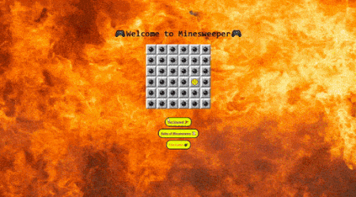

# Minesweeper-Game
Minesweeper Game App created through React.

# Minesweeper #
## Goal of Minesweeper Game: ##

* Click on various tiles in order to display what the tile holds.

* Beware though not to click on a tile that holds a mine because that will be the end of the round.

* Use the the indicating numbers of all the surrounding mines neighboring the tile clicked upon.

  **Tip:** *Each tile has only eight tiles that surround it.*
  
* If you manage to open all the tiles that do not hold a mine, you win the round!

## RULES OF MINESWEEPER GAME: ##

* There are 10 flags available to place in the positions where mines are suspected to be. 

* The mines are dispersed randomly accross the board with each round. Work your way around the hidden mines with use of the indicating  number of mines that the tiles display, this will give you an idea of which tiles to avoid. If you suspect a tile to hold a mine, flag it by right-clicking on the specific tile. 

  **Note:** *You can get a flag back by right-clicking on the tile that already holds a flag, to retrieve the flag, for you to use                  again later.*

* If you happen to click on a tile that hold a hidden mine, the game will end. You can carry on playing by clicking on the face at the top of the board to reset the game which will allow you to play a new round of minesweeper. 

* Open all the tiles that don't have a mine in order to win the round. Don't worry, you will get the hang of the game rather quickly.

### Be smart, be calm and sweep past all the mines! ###

# Demo #

 
Demo Display :tv:

 

### How to install Minesweeper to your local drive:

* cd to the root directory of the Minesweeper folder & type 'npm i' in the command terminal to download all the node-module files required for the app to run.
* After the node-module files are installed, type 'npm start' to run the app. 
* The app should automatically open up and be available to play.
  

